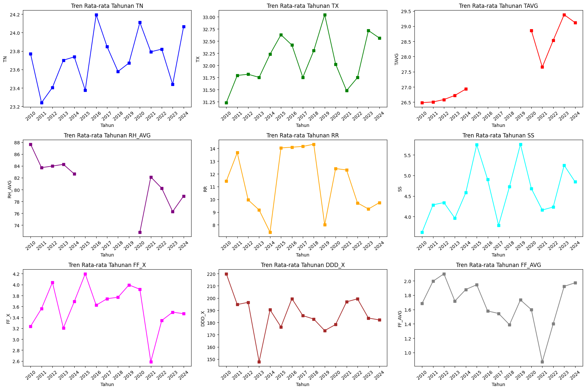
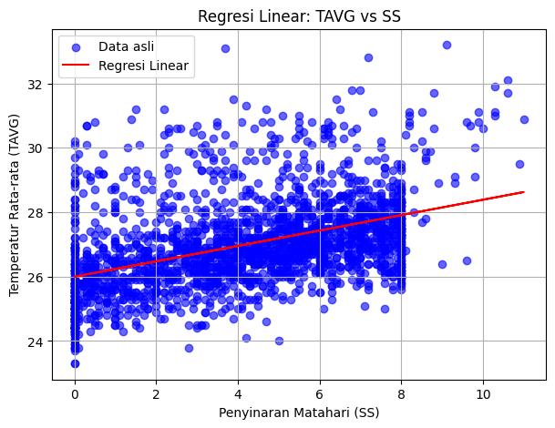

# 🌤️ Climate Trend Analysis (BMKG) — 2010–2024

Analisis tren **Iklim** berdasarkan data pengamatan BMKG dari tahun 2010–2024.  
Proyek ini mencakup proses **pembersihan data (data cleaning)**, **transformasi waktu (time series)**, dan **visualisasi tren iklim** menggunakan Python.

---

## 🎯 Objectives
- Membersihkan data iklim mentah dari BMKG (menghapus duplikasi dan nilai error seperti 8888, 9999, “-”).
- Membuat dataset bersih untuk analisis lanjutan.
- Menelusuri pola perubahan suhu dan kelembapan dalam periode 2010–2024.
- Menampilkan hasil analisis melalui grafik tren tahunan dan bulanan.

---

## 🧰 Tools & Libraries
- **Python** — Data analysis  
- **pandas, numpy** — Cleaning & transformasi data  
- **matplotlib, seaborn** — Visualisasi  
- **scikit-learn** — Regresi linear (TAVG vs SS)  
- **Jupyter Notebook** — Dokumentasi proses analisis  

---

## 📄 Jurnal
Penelitian ini merupakan bagian dari tugas akademik Universitas Tarumanagara berjudul:  
**“Analisis Tren Iklim Tahun 2010–2024 di Banjarbaru”**  

📘 **Dokumen lengkap:** [Climate_Trend.pdf](Climate_Trend.pdf)  
🧾 **Deskripsi singkat:**  
Analisis dilakukan terhadap data iklim BMKG yang mencakup suhu maksimum, suhu minimum, kelembapan, curah hujan, dan penyinaran matahari.  
Data dibersihkan, diproses, dan divisualisasikan untuk mendeteksi tren perubahan iklim di wilayah Banjarbaru.

---

## 📊 Data Overview
- **Sumber:** BMKG (Badan Meteorologi, Klimatologi, dan Geofisika)  
- **Periode:** 2010–2024  
- **Variabel utama:**
  - `TN` — Suhu minimum harian (°C)
  - `TX` — Suhu maksimum harian (°C)
  - `TAVG` — Suhu rata-rata harian (°C)
  - `RH_AVG` — Kelembapan rata-rata (%)
  - `RR` — Curah hujan (mm)
  - `SS` — Lama penyinaran matahari (jam)
  - `FF_X`, `DDD_X`, `FF_AVG` — Kecepatan dan arah angin

---

## 📈 Hasil Analisis dan Visualisasi

### 🔹 Tren Tahunan Semua Variabel

### 🔹 Tren Bulanan Semua Variabel

### 🔹 Hubungan Linear: Penyinaran Matahari (SS) vs Suhu Rata-rata (TAVG)

---

## 💡 Insights
- Terjadi **kenaikan suhu rata-rata tahunan** sejak tahun 2018.  
- Kelembapan udara menunjukkan **penurunan pada musim kemarau**.  
- Korelasi positif antara **penyinaran matahari (SS)** dan **temperatur rata-rata (TAVG)**.  
- Curah hujan berfluktuasi tanpa tren jelas, namun selaras dengan musim tahunan.

---

## 👤 Author
**Michael Al Fanathan Sevanno**  
Information Systems — Universitas Tarumanagara  
📧 michaelsevanno05@gmail.com  
📍 Jakarta, Indonesia