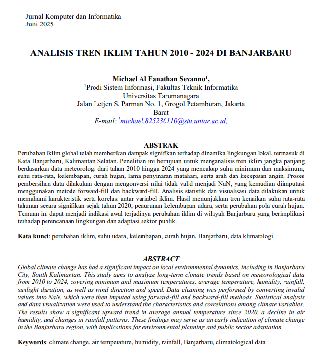

# 📊 Data Portfolio — Michael Al Fanathan Sevanno

Welcome to my personal data portfolio!  
This repository showcases my academic and personal projects.

---

## 🧠 About Me
Information Systems student at **Universitas Tarumanagara** (Jakarta, Indonesia)  
Interested in **data analytics, Full Stack Developer, and Quality Assurance**.  
Currently preparing for an **MBKM internship program (2025)** focusing on data analysis.

**Tools & Skills:**
- Python (pandas, matplotlib, seaborn)
- SQL (query, join, aggregation)
- Google Looker Studio & Power BI
- Excel & Google Sheets (dashboard, pivot, formula)
- ETL & Data Warehouse (conceptual)
- HTML, PHP, CSS

---

## 📂 Featured Projects

### 🛍️ 1. [Retail Analytics Dashboard — Google Looker Studio](https://lookerstudio.google.com/reporting/cf38e81b-31c6-4053-973a-b1e931a0bfb2)
**Goal:** Analyze sales and customer data through interactive dashboards  
**Tools:** Google Looker Studio, Google Sheets  
**Highlights:**  
- Displayed KPIs (Sales, Profit, Quantity, Customers)  
- Monthly sales trends visualization  
- Geo map of customer distribution  
- Product performance by category  

📸 *Screenshots:*  

---

### 🌦️ 2. [Climate Trend Analysis 2010–2024 (BMKG Data)](Documents/Climate_Trend.pdf)
**Goal:** Detect long-term Climate trends in Banjarbaru (2010–2024)  
**Tools:** Python (pandas, matplotlib, seaborn)  
**Highlights:**  
- Cleaned and visualized 15 years of climate data  
- Identified seasonal variation and correlation among climate variables  

📸 *Abstrak*  

---

###  3. [Destinasi Wisata Front end & Back End]
**Goal:** Detect long-term Climate trends in Banjarbaru (2010–2024)  
**Tools:** Python (pandas, matplotlib, seaborn)  
**Highlights:**  
- Cleaned and visualized 15 years of climate data  
- Identified seasonal variation and correlation among climate variables  

📸 *Abstrak*  

---

## 🧑‍💻 Contact
📧 **michaelsevanno05@gmail.com**  
📍 Jakarta, Indonesia  
🔗 **LinkedIn:** [linkedin.com/in/michael-sevanno](#)  
