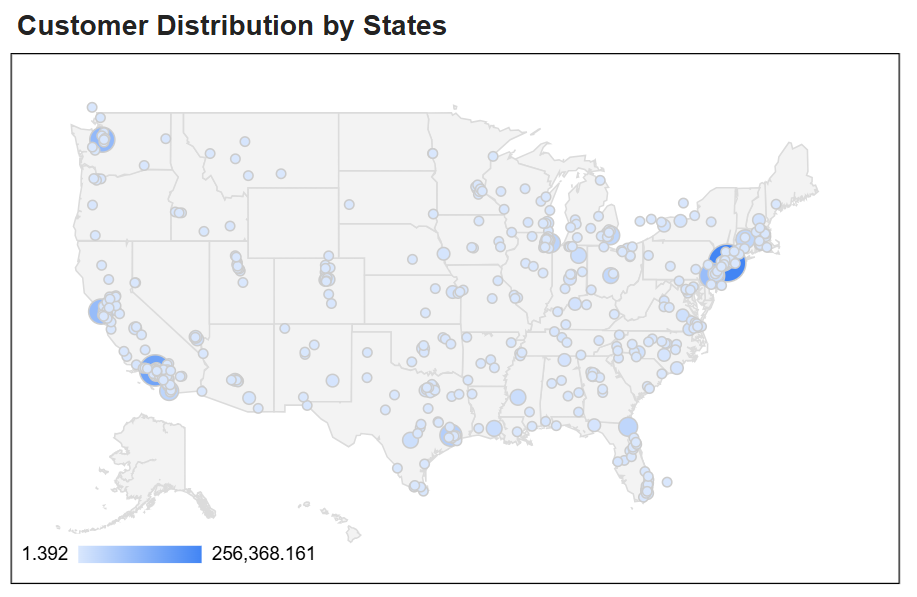

# 🛍️ Retail Analytics Dashboard — Google Looker Studio

Dashboard interaktif yang dirancang untuk menganalisis performa penjualan, profit, dan pelanggan.  
Proyek ini dibuat menggunakan **Google Looker Studio** dengan dataset *Sample Superstore* sebagai bagian dari portfolio analisis data.

Dashboard ini menampilkan KPI utama, tren penjualan, kategori produk, distribusi pelanggan berdasarkan wilayah, produk terlaris, serta pelanggan paling loyal.

---

## 📊 Dashboard Overview

Menampilkan indikator utama bisnis:
- **Total Sales**
- **Total Profit**
- **Total Quantity Sold**
- **Total Customers**

---

## 📈 Monthly Sales & Profit Trend

Grafik ini memperlihatkan tren penjualan dan profit bulanan selama beberapa tahun terakhir, membantu memahami pola musiman dan pertumbuhan penjualan.

---

## 🪜 Sales by Product Category

Menunjukkan total penjualan berdasarkan kategori produk (Office Supplies, Furniture, dan Technology), berguna untuk mengetahui kategori yang paling berkontribusi terhadap revenue.

---

## 🌍 Customer Distribution by Region

Visualisasi geografis yang memperlihatkan distribusi pelanggan dan total penjualan berdasarkan wilayah.  
Membantu mengidentifikasi area dengan performa penjualan tertinggi.

---

## 🏆 Top Selling Products

Menampilkan tabel produk dengan urutan penjualan tertinggi, lengkap dengan total sales dan profit untuk mendukung keputusan inventory dan strategi promosi.

---

## 💬 Category by Sales & Top 10 Loyal Customers

Menunjukkan proporsi penjualan per kategori produk dan daftar pelanggan paling loyal berdasarkan total pembelian mereka.

---

## ⚙️ Tools Used
- **Google Looker Studio** — untuk pembuatan dashboard
- **Google Sheets** — sebagai data source
- **Dataset:** [Sample Superstore](data/sample_superstore.csv)  

---

## 🌐 Live Dashboard
🔗 [Lihat Dashboard Interaktif di Google Looker Studio](https://lookerstudio.google.com/reporting/cf38e81b-31c6-4053-973a-b1e931a0bfb2)  

---

## 👤 Author
**Michael Al Fanathan Sevanno**  
Information Systems Student — Universitas Tarumanagara  
📧 michaelsevanno05@gmail.com  
📍 Jakarta, Indonesia
