###  3. [Destinasi Wisata — Full Stack Development (Front End & Back End)]
**Goal:** Build a complete Tourism Destination Web that includes both frontend and backend for managing destinations, categories, testimonials, and regional data.
**Tools:** PHP, HTML, & CSS 

---

✨ Frontend — Jadoo Tour & Travel Website
A responsive, modern landing page introducing Indonesia’s tourism experiences with attractive visuals and smooth navigation.
**Highlights:**  
- Built Top Destinations, Categories, and Trip Planning sections with dynamic layouts
- Designed with PHP,HTML, & CSS
- Integrated Testimonials and Booking Info components
- Implemented clean, consistent UI design for professional look

📸 *Frontend Screenshoots*  
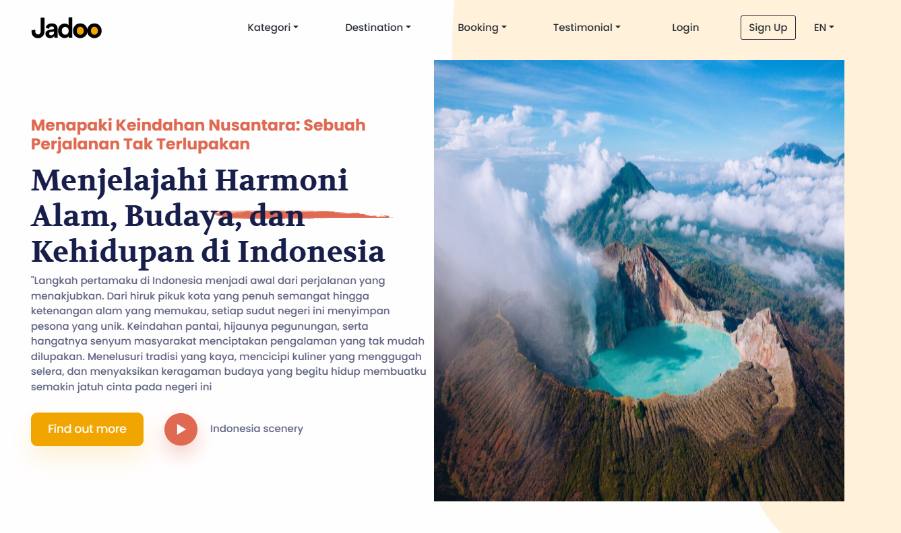
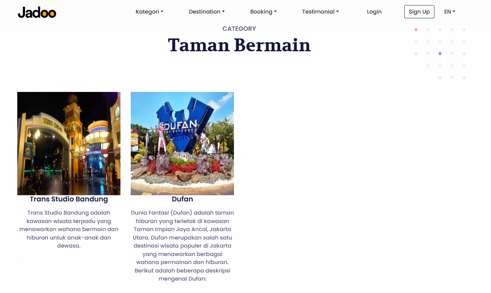
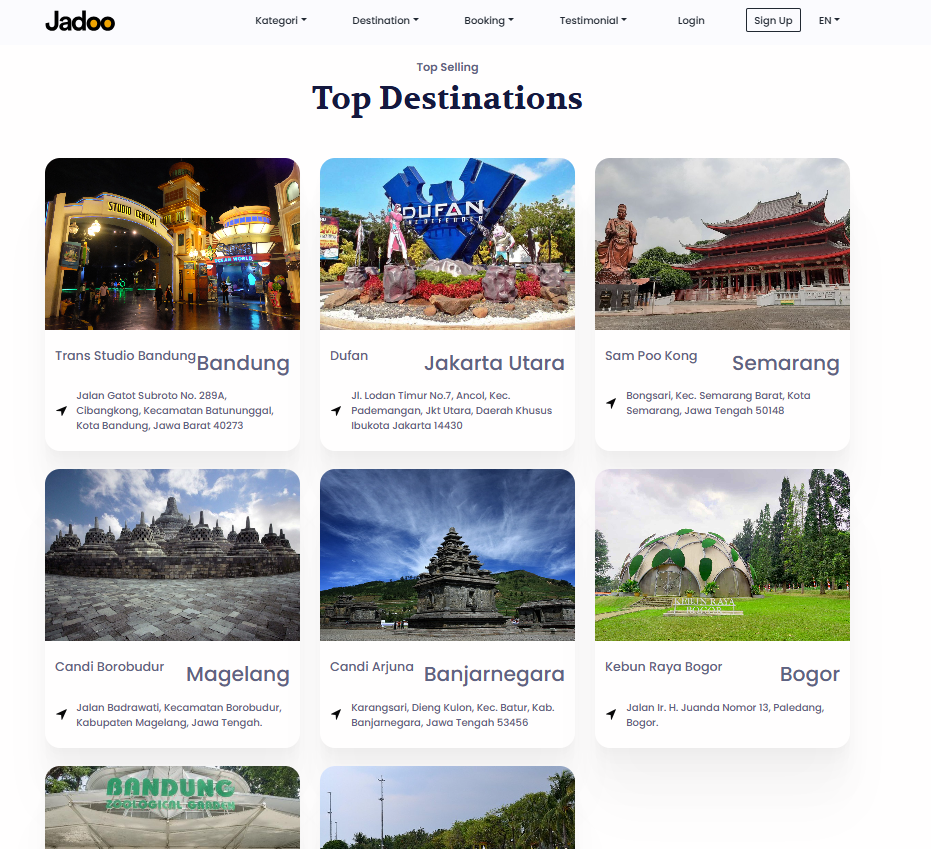
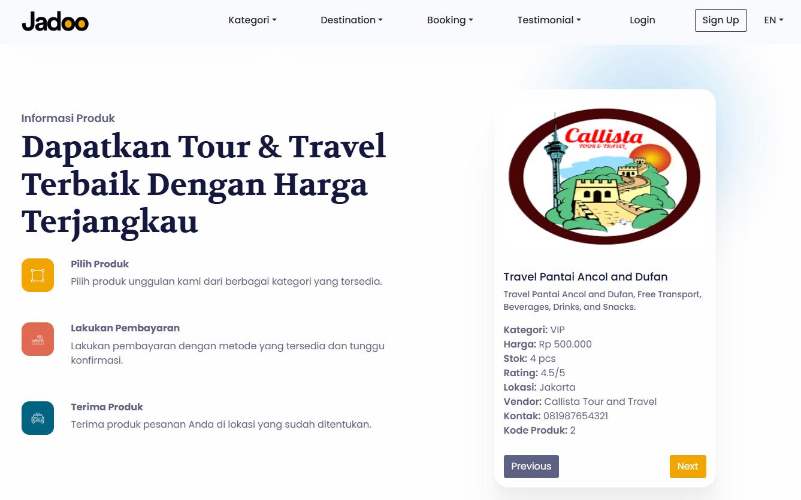
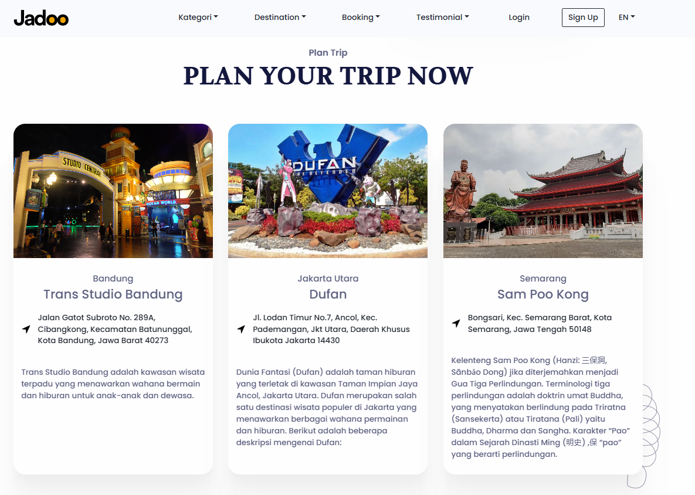

---

⚙️ Backend — Destinasi Wisata Management System
An admin dashboard designed for managing tourism data such as destinations, provinces, districts, categories, and testimonials.
**Highlights:**  
- Secure Login system with session validation
- Full CRUD features for all data modules (Province, District, Destination, News, Testimonials, Categories, etc.)
- Support for file uploads (images & content)
- Built using PHP, HTML, & CSS
- Designed responsive interface for admin operations

📸 *Backend Screenshoots*
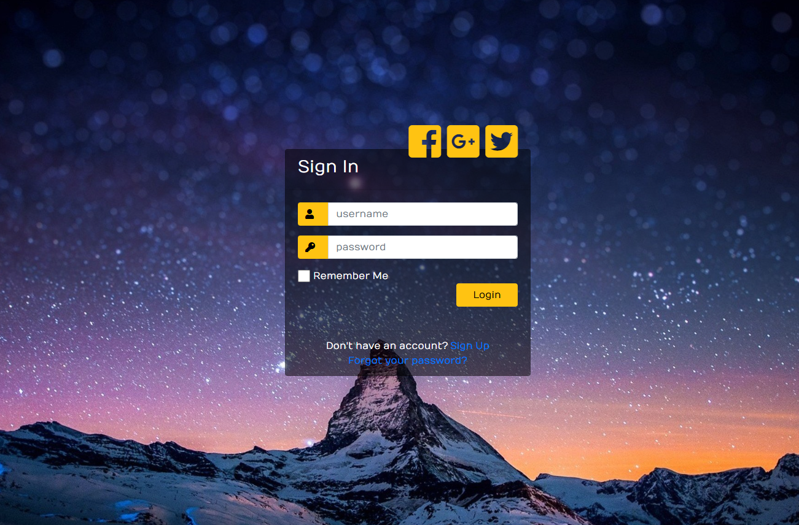
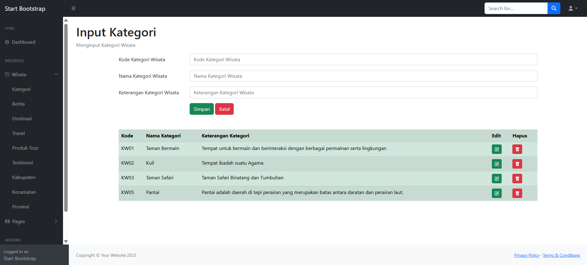
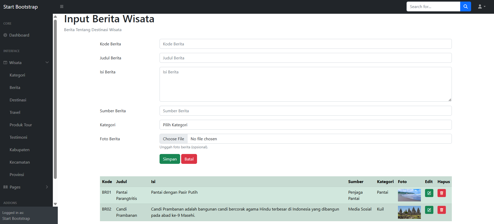
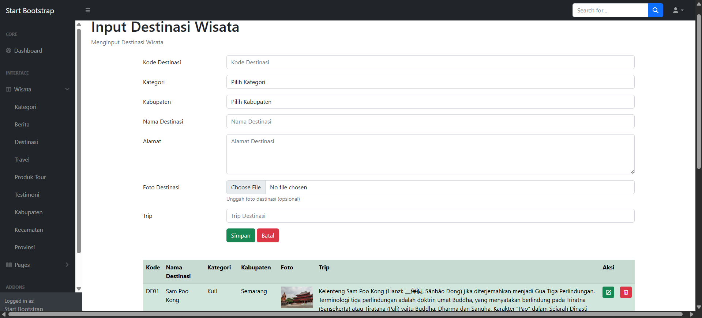
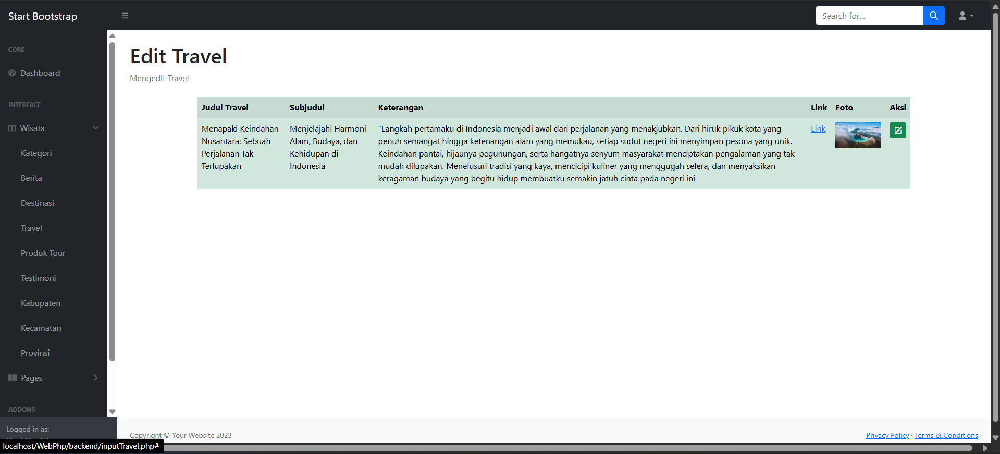
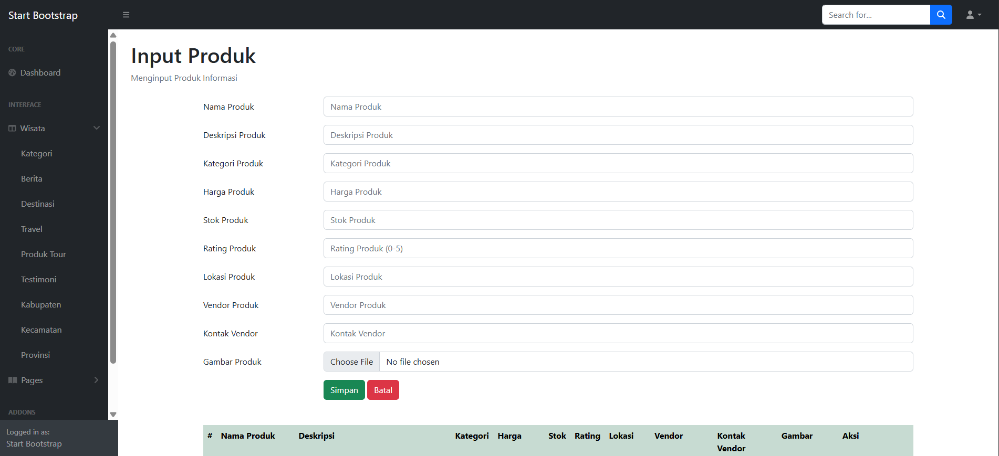
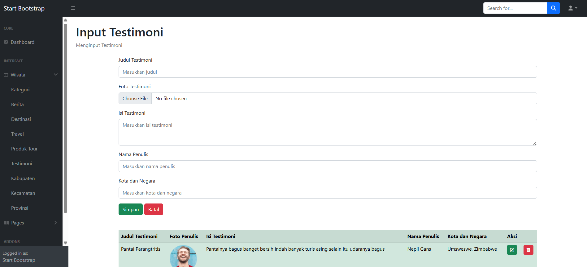
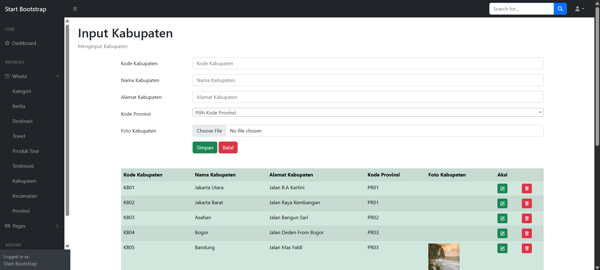
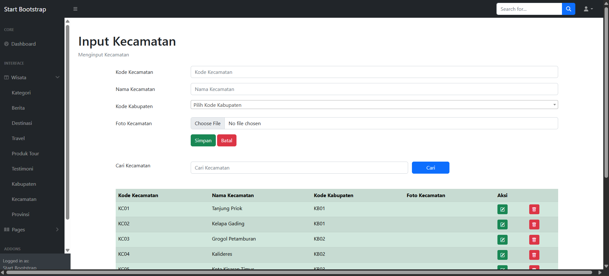
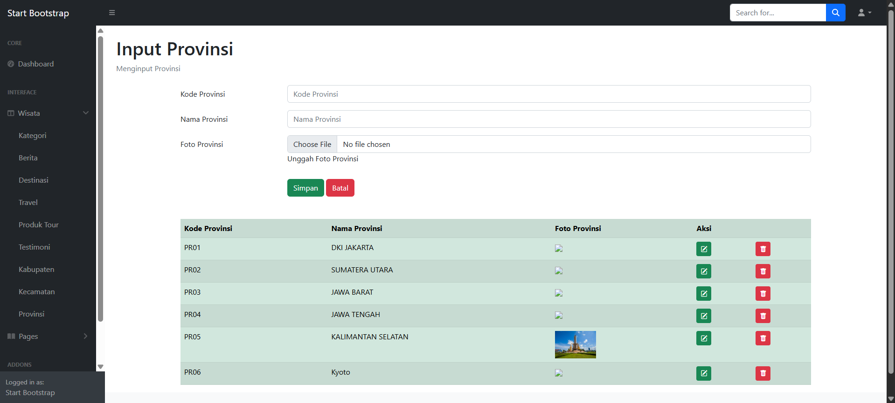